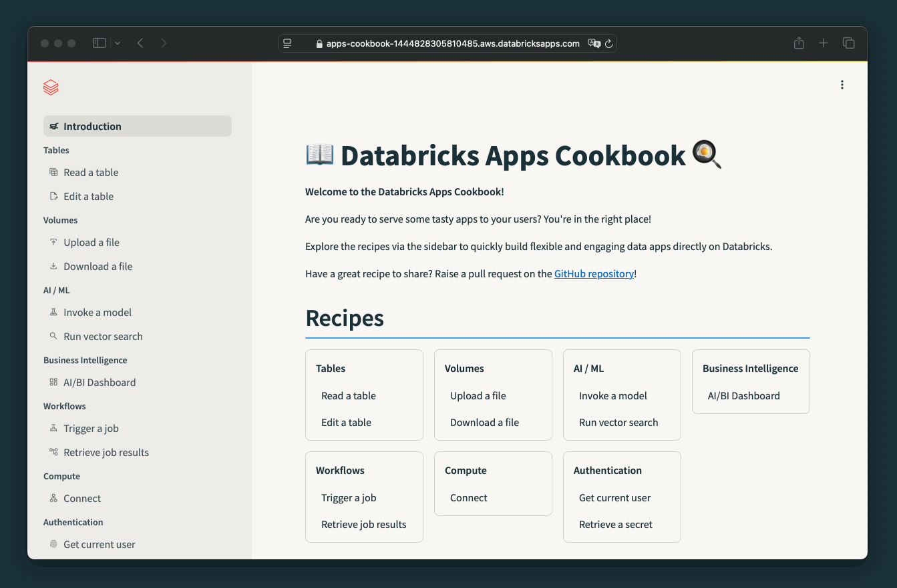

# 📖 Databricks Apps Cookbook 🍳 + Unity Catalog Governance

> **This is a fork.** It extends the upstream [databricks-apps-cookbook](https://github.com/databricks-solutions/databricks-apps-cookbook) (commit `88a0387`) with a Unity Catalog governance extension.
>
> - **[DEPLOY.md](DEPLOY.md)** — deploy this repo to Databricks Apps.
> - **[governance-app/README.md](governance-app/README.md)** — what the governance extension does, required UC privileges, and its limits (Vietnamese).
> - **[README_GOVERNANCE_VI.md](README_GOVERNANCE_VI.md)** — full governance notes (Vietnamese).
>
> Two deployable source roots: `streamlit/` (all Cookbook recipes **plus** the Governance menu) and `governance-app/` (governance only, fewer dependencies). Everything below is the upstream README.

---

Ready-to-use code snippets for building data and AI applications using [Databricks Apps](https://docs.databricks.com/en/dev-tools/databricks-apps/index.html).

Learn more about the Databricks Apps Cookbook on **[apps-cookbook.dev](https://apps-cookbook.dev/)**.

## What is the Databricks Apps Cookbook?

- **10+ recipes for common Apps use cases** such as reading and writing to and from tables and volumes, invoking traditional ML models and GenAI, or triggering workflows.
- **Try recipes in the Cookbook app** and simply copy a code snippet to build your own.
- **Description of requirements** (permissions, resources, dependencies) for each recipe.
- Deploy to Databricks Apps or run locally.
- Snippets for **Dash, Streamlit, Reflex, and FastAPI** are available.

## Documentation

Find **deployment instructions** and all **code snippets** on [apps-cookbook.dev](https://apps-cookbook.dev/).

## Contributions

We welcome contributions! Submit a [pull request](https://github.com/databricks-solutions/databricks-apps-cookbook/pulls) to add or improve recipes. Raise an [issue](https://github.com/databricks-solutions/databricks-apps-cookbook/issues) to report a bug or raise a feature request.

Not sure what to contribute? Here are some commonly requested samples:

- Write data from a form into a Delta table
- Display coordinates from a Delta table in a map component
- Display data from a Delta table in Streamlit/Dash-native diagram components
- Gradio implementation
- Flask implementation

## Support

These samples are experimental and meant for demonstration purposes only. They are provided as-is and without formal support by Databricks. Ensure your organization's security, compliance, and operational best practices are applied before deploying them to production.

## License

&copy; 2025 Databricks, Inc. All rights reserved. The source in this notebook is provided subject to the [Databricks License](https://databricks.com/db-license-source). All included or referenced third party libraries are subject to the licenses set forth below.

| library   | description                                       | license    | source                                           |
| --------- | ------------------------------------------------- | ---------- | ------------------------------------------------ |
| Plotly    | Graphing library for interactive visualizations   | MIT        | [GitHub](https://github.com/plotly/plotly.py)    |
| Dash      | Framework for building web apps with Plotly       | MIT        | [GitHub](https://github.com/plotly/dash)         |
| Streamlit | App framework for Machine Learning and Data Apps  | Apache 2.0 | [GitHub](https://github.com/streamlit/streamlit) |
| FastAPI   | High-performance API framework based on Starlette | MIT        | [GitHub](https://github.com/tiangolo/fastapi)    |
